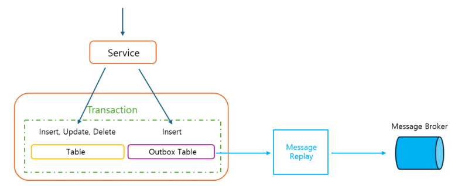

## 브랜치 전략 : Github Flow

branches[ "master", develop", "feature-*"]

1. master 브랜치에서 develop 브랜치 분기
2. 기능 구현을 하는 경우 develop 브랜치에서 feature-* 브랜치를 분기
3. 개발이 끝난 feature-* 브랜치는 develop 브랜치로 merge (dev deploy)

   (develop 브랜치에 한 feature 당 하나의 커밋, 한 bugfix 당 하나의 커밋을 유지)
   - --squash 옵션을 사용하여 merge
   - git rebase의 interactive 모드를 사용
4. production 배포할 경우 develop 브랜치는 master 브랜치로 병합 (prod deploy)

**feature**
- 새로운 기능이나 버그 수정 작업을 수행하기 위한 브랜치
- 이 브랜치는 작업의 컨텍스트를 제공하고, 기능의 독립성을 보장
---

## 대기열 설계

- 대기열은 사용자가 콘서트 예약 및 결제 서비스를 이용하기에 앞서 서비스를 이용할 수 있는 사용자인지를 검증하기 위해서 사용 되며, 
대규모 트래픽이 한번에 몰릴 수 있는 도메인 서비스에 접근하는 것을 방지하기 위한 목적으로 사용됩니다.
- 대기열은 두가지 상태를 가지고 있으며, 서비스 이용을 위해 대기하거나, 서비스를 이용할 수 있습니다.
   대기열 만료 시간이 지난 사용자는 삭제가 되기 때문에 별도의 상태를 관리하지 않습니다.

**1. Waiting Queue `redissonClient.getScoredSortedSet("waitQueue");`**
- Redis Sorted Set 자료 구조를 기반으로 만들어진 RScoredSortedSet 사용 
- `waitQueue.add(System.currentTimeMillis(), userId);` Key는 userId, Score는 요청시간을 저장
- add 명령어는 내부적으로 Redis `ZADD` 명령어로 신규 대기열을 추가하고, `RANK` 대기열 순번을 반환합니다.
- 대기열에 이미 존재하는 사용자가(활성화 되지 않은 사용자)가 대기열을 다시 신청하는 경우 순번은 맨 뒤로 밀리게 됩니다.

**2. Ongoing Queue `redissonClient.getMapCache("ongoingQueue");`**
- Redis Hash 자료 구조를 기반으로 만들어진 RMapCache 사용
- Hash와 차이점은 Hash는 개별 요소 대해 TTL 설정이 불가능 하지만, RMapCache는 개별 요소에 대해 TTL 사용이 가능하다.(대기열 만료시간)
- 콘서트 최종 결제가 성공한 사용자는 OngoingQueue에서 제거

**3. 대기열 활성화 스케쥴러**
- 스케쥴러를 통해서 `QUEUE_LIMIT - iQueueRedisRepository.getOngoingCount()` 대기열 진입 가능한 수 계산
- 대기열 진입 가능 한 수 만큼 `waitQueue.pollFirst(availableQueueCount).stream().toList();` poll() -> 내부적으로 Redis `ZRANGE` 명령어를 사용해서 1번째 순번부터 availableQueueCount 까지 삭제
- waieQueue에서 삭제된 userId들을 OngoingQueue로 삽입하며 대기열 만료 시간 만큼 활성화

### 대기열 설계 방향성 선정 과정      
1. 대기열 활성화의 경우 TTL없이 OngoingQueue 에서 만료된 토큰의 수 만큼 WaitingQueue에서 전환되는 경우
- 서비스를 이용할 수 있는 사용자를 항상 일정 수 이하로 유지할 수 있다는 장점이 있지만 
- 서비스를 이용하는 사용자의 액션하는 속도에 따라 대기열의 전환시간이 불규칙하다는 단점이 있다.

2. N초마다 M개의 토큰을 OngoingQueue로 전환하는 경우 
- 대기열 고객에게 서비스 진입 가능 시간을 대체로 보장할 수 있지만 
- 서비스를 이용하는 사용자의 수가 보장될 수 없다.


우선적으로 첫번째 방식과 두번째 방식의 각각의 장단점을 파악하여 설계

첫번째 방식에서 가장 큰 문제점인 앞사람이 완료하지 않으면 뒷사람이 들어갈 수 없는 문제를 해결하기 위해 각 사용자에 대하여 평균적인 시간(한 유저가 콘서트 조회를 시작한 이후에 하나의 예약을 완료할 때까지 걸리는 시간)을 고려하여
대기열 만료시간을 설정, 두번째 방식에서 적절한 동시 접속자를 유지하기 위해서 서버 트래픽의 최대치를 고려하여 `QUEUE_LIMIT`로 동시 접속자 제한을 두어 처리

---

## 동시성 문제 유즈케이스

### Redisson 라이브러리를 이용하여 분산락 적용

Simple Lock의 경우 key 선점에 의한 lock 획득 실패 시, 비즈니스 로직을 수행하지 않기 때문에 포인트 로직에 맞지 않다고 판단하였고, Spin Lock의 경우 Lock을 획득하기 위해 지속적인 재시도로 인한 성능적인 부분을 고려하여
Redisson을 이용한 PUB/SUB 방식의 분산 lock 사용

Lettuce을 이용하여 분산락 구현 시 `setnx`,`setex`과 같은 명령어를 이용해 지속적으로 Redis에게 요청을 보내는 스핀락 방식으로 동작
요청이 많을수록 Redis가 받는 부하가 커지게 되지만 `Redisson`은 Pub/Sub 방식을 이용하기 때문에 락이 해제되면 락을 subcribe하는
클라이언트는 락이 해제되었다는 신호를 받고 락 획득을 시도
### 대기열
동시성 케이스
- 한 명의 사용자가 대기열을 여러번 신청 하는 케이스
- 여러명의 사용자가 대기열을 동시에 신청 하는 케이스 (QUEUE_LIMIT)

**AS-IS (RDB)**

대기열의 경우 토큰이 없는 경우에는 토큰에 대한 ROW가 존재 하지 않기 때문에 DB LOCK을 통한 제어가 불가능.
위 문제점을 해결 하기 위한 방안으로 대기열 테이블을 2개로 구성 하여 해결이 가능 (ONGOING TABLE, WAIT TABLE로 나누어서 구성)
1) 대기열에 신청 API를 호출하는 경우 WAIT TABLE에 등록
2) WAIT TABLE -> ONGOING TABLE 서버에서 스케쥴러를 통한 작업

-> RDB를 사용해서 대기열 동시성 문제를 처리하기 위해서는 테이블을 분리해야 하므로 관리 포인트가 늘어나기 때문에 Redis을 사용하여 대기열 로직 리팩토링

**TO-BE (REDIS)**

1) 대기열 신청시 Redis SortedSet을 사용한 Wait Queue에 순차적으로 넣음
2) 스케쥴러를 통해서 Wait Queue에 쌓인 유저들을 Redis CacheMap(Hash 기반 Redisson 자료구조) 자료 구조를 사용한 Ongoing Queue로 이동
3) Ongoing Queue는 대기열 만료 시간 TTL을 사용하여 대기열 관리
4) 대기열 신청 API를 재호출 하는 경우 순번이 뒤로 밀려남

### 포인트 충전/사용
- 포인트를 동시에 충전 하는 케이스
- 포인트를 동시에 사용 하는 케이스

**AS-IS (RDB)**

Database Lock, 비관적 락을 사용하여 동시성 제어

**TO-BE (REDIS)**

Redisson 라이브러리를 사용하여 분산락(PUB/SUB) 사용

LOCK Key = LOCK : POINT : CHARGE : userId

LOCK Key = LOCK : POINT : USE : userId

### 좌석 예약
- 여러명의 사용자가 같은 좌석 예약 신청 하는 케이스

**AS-IS (RDB)**

Database Lock, 비관적 락을 사용하여 동시성 제어

**TO-BE (REDIS)**

Redisson 라이브러리를 사용하여 분산락(PUB/SUB) 사용

LOCK Key = LOCK : SEAT + seatId : CONCERT + concertOptionId

---

## Query 분석 및 DB Index 설계
성능 조회를 위한 더미데이터 삽입

- conert table 1,000개 데이터  
- concert_option table 13,000개 데이터

예약 가능한 콘서트 조회 쿼리

```mysql
select
   co.concert_option_id,
   c.name,
   c.singer,
   c.venue,
   co.start_date
from
    concert c
join
    concert_option co
        on c.concert_id=co.concert_id
where
    co.reservation_start_date<now()
    and co.start_date>now()
```
where 조건 ( 콘서트 예약 시작일은 지났지만 아직 시작하지 않은 콘서트 조회 )
1. 현재 날짜가 콘서트 예매 시작일(coe1_0.reservation_start_date < now())보다 이후 날짜
2. 현재 날짜가 콘서트 시작일(coe1_0.start_date > now()) 이전 날짜

where 조건으로 조회시 사용되는 concert_option 테이블의 reservation_start_date, start_date에 대하여 index 생성

### 인덱스 적용 전 실행계획
```json
[
   {
      "id": 1,
      "select_type": "SIMPLE",
      "table": "coe1_0",
      "partitions": null,
      "type": "ALL",
      "possible_keys": null,
      "key": null,
      "key_len": null,
      "ref": null,
      "rows": 12072,
      "filtered": 11.11,
      "Extra": "Using where"
   },
   {
      "id": 1,
      "select_type": "SIMPLE",
      "table": "ce1_0",
      "partitions": null,
      "type": "eq_ref",
      "possible_keys": "PRIMARY",
      "key": "PRIMARY",
      "key_len": "8",
      "ref": "mysql.coe1_0.concert_id",
      "rows": 1,
      "filtered": 100,
      "Extra": null
   }
]
```

### 인덱스 적용 후 실행계획
```json
[
   {
      "id": 1,
      "select_type": "SIMPLE",
      "table": "coe1_0",
      "partitions": null,
      "type": "range",
      "possible_keys": "idx_test",
      "key": "idx_test",
      "key_len": "9",
      "ref": null,
      "rows": 2000,
      "filtered": 33.33,
      "Extra": "Using where"
   },
   {
      "id": 1,
      "select_type": "SIMPLE",
      "table": "ce1_0",
      "partitions": null,
      "type": "eq_ref",
      "possible_keys": "PRIMARY",
      "key": "PRIMARY",
      "key_len": "8",
      "ref": "mysql.coe1_0.concert_id",
      "rows": 1,
      "filtered": 100,
      "Extra": null
   }
]
```
인덱스 적용 전과 후의 실행계획을 비교했을때 가장 눈에 띄는 부분은 `type`, `rows`, `filtered` 이다.

### 인덱스 적용 전
`"type": "ALL"`, `"rows": 12072`

### 인덱스 적용 후
`"type": "range"`, `"rows": 2000`


`"type":"ALL"` 테이블 풀 스캔으로 활용할 인덱스가 없거나 인덱스 사용이 비효율적이라고 옵티마이저의 판단 시 사용

`"type": "range"` 인덱스 레인지 스캔으로 검색해야 할 인덱스의 범위 지정시 사용되며(인덱스의 범위가 결정됐을 때), B-Tree 인덱스를 통한 데이터 읽기 방식중 가장 빠른 방식으로 루트 노드 -> 브랜치 노드 -> 리프 노드를 거쳐서
인덱스를 통해서 스캔해야할 지점을 찾아 차례대로 쭉 인덱스를 읽어 스캔하는 방식

`rows` SQL 문을 수행할 때 접근한 데이터의 모든 행(row) 수를 나타내는 예측 항목
(SQL 문의 실제 결과와 rows가 차이가 큰 경우 MySQL 엔진에서 데이터를 많이 가져왔다는 뜻으로 튜닝 대상이 될 수 있다)

`filtered` SQL 문을 통해 MySQL 엔진이 스토리지 엔진으로부터 가져온 데이터를 필터 조건에 따라 제거된 비율

인덱스를 적용함으로써 테이블 풀 스캔에서 인덱스 레인지 스캔으로 변경되었고, SQL 문 수행 시 접근한 데이터의 row 수가
12,072 -> 2,000으로 확연하게 줄었들었다.
정확한 서비스 실행속도는 아니지만 평균적인 실행속도로 실행시간 69ms -> 실행속도 40ms, 약 42% 감소 하는 결과를 얻을 수 있었다.

---

## 책임 분리를 통한 애플리케이션 설계

서비스의 규모 확장으로 인해 결제 내역을 외부 데이터 플랫폼으로 전송 해야 하는 비즈니스 로직이 추가 되었다고 가정

현재 로직
1. 좌석 임시 예약
2. 임시 예약된 좌석 결제
3. 예약된 좌석내역 reservation_history 저장 (TODO: event로 변경할 예정)
4. (추가) 결제 내역 전송을 위한 외부 API 호출 

현재 로직에서 단순히 예약된 좌석 내역에 대한 메타 데이터를 reservation_history에 저장하는 로직 외에 외부 API 호출을 통해 전달해야 한다.

### 문제
1. 외부 서비스가 정상이 아닐 경우 트랜잭션 처리

외부 서비스를 실행하는 과정에서 익셉션이 발생하면 트랜잭션을 롤백 해야 할까?

(좌석 예약은 성공 하였으니 롤백해야 될 상황은 아닌 것으로 판단 -> 외부 서비스 재호출)

2. 성능

외부 시스템의 응답 시간이 길어지면 그 만큼 대기 시간도 길어진다. 즉, 외부 서비스 성능에 직접적인 영향을 받게 된다.

3. 좌석 도메인에서 외부 API 호출에 대한 로직이 뒤섞이게 된다. (강결합)

위 문제를 해결하기 위해 `Event` 사용

`Event` 를 발행 및 구독하는 모델링을 통해 코드의 강한 결합을 분리함

`Event` 에 의해 본인의 관심사만 수행하도록 하여 비즈니스 로직간의 의존을 느슨하게 함

### 해결방법

**동기 이벤트**

이벤트를 사용해서 강결합 문제는 해결할 수 있지만 외부 서비스에 대한 영향을 받게 된다.
즉 위에 1번, 2번 문제가 해결되지 않는다.

**비동기 이벤트**

이벤트 핸들러를 비동기로 실행하는 방법은 이벤트 핸들러를 별도 스레드로 실행하는 것이다. 

- 메시징 시스템을 이용한 비동기 구현
- 이벤트 저장소를 이용한 비동기 처리 (API 방식, 포워더 방식)

**비동기 이벤트 구현**

```java
@RequiredArgsConstructor
@Component
public class PaymentFacade {

   private final QueueService queueService;
   private final ConcertSeatService concertSeatService;
   private final PointService pointService;

   @Transactional
   public PaymentResponse payment(PaymentRequest paymentRequest) {
      Long userId = paymentRequest.userId();

      //임시 예약된 좌석들 가져오기
      List<ConcertSeat> temporarilyReservedSeats = concertSeatService.findSeatTemporarilyReservedByUserId(userId);
      Long paymentAmount = temporarilyReservedSeats.stream().mapToLong(ConcertSeat::getPrice).sum();

      //예약된 좌석들의 총 금액 결제
      PointUseRequest pointUseRequest = PointUseRequest.builder().userId(userId).point(paymentAmount).build();
      pointService.use(pointUseRequest);

      //좌석 예약처리 -> 예약 내역 반환
      List<Reservation> reservations = concertSeatService.updateSeatToReserved(userId, temporarilyReservedSeats);

      //대기열 삭제
      queueService.expire(userId);

      //외부 플랫폼 API 호출
      Events.raise(PaymentCompletedEvent.builder().reservations(reservations).build());

      return PaymentResponse.builder()
              .code(ResponseCode.SUCCESS)
              .build();
   }
}
```

```java
@RequiredArgsConstructor
@Component
public class PaymentCompletedEventHandler {

    private final ExternalPaymentProducer externalPaymentProducer;

    @EventListener(PaymentCompletedEvent.class)
    public void handle(PaymentCompletedEvent event) {
        externalPaymentProducer.sendPayment(event.getReservations());
    }
}
```

```java
@Component
@RequiredArgsConstructor
public class ExternalPaymentProducer {

    private final KafkaTemplate<String, Object> kafkaTemplate;

    public void sendPayment(List<Reservation> message) {
        kafkaTemplate.send("payment_topic", message);
    }
}
```

```java
public class ExternalPaymentConsumer {

    private final WebClient.Builder webClientBuilder;

    @KafkaListener(topics = "payment_topic", groupId = "payment_group")
    public void consume(Object obj) {
        ConsumerRecord<String, List<Reservation>> result = (ConsumerRecord<String, List<Reservation>>) obj;
        sendToExternalDataPlatform(result.value());
    }

    public void sendToExternalDataPlatform(List<Reservation> reservations) {
        WebClient webClient = webClientBuilder.baseUrl("http://localhost:8080").build();

        webClient.post()
                .uri("/api/data")
                .bodyValue(reservations)
                .retrieve()
                .bodyToMono(String.class)
                .block();
    }
}
```

최종결제가 정상적으로 성공한다면 `Events.raise(PaymentCompletedEvent.builder().reservations(reservations).build());`

외부 API 호출에 대한 event를 발행하게 됩니다.

Facede를 통해서 payment()전체가 Transactional로 동작하기 때문에 결제 로직 진행중 롤백이 되면 외부 API에 대한 호출 event는 동작이 되지 않습니다.

그럼 PaymentCompletedEvent가 동작후 카프카의 메시지 발행이 실패하는 경우엔?

위 상태라면 메시지가 정상적으로 발행되지 않은 경우 확인이 불가능

카프카 메시지 발행에 대해 보장을 하기 위해서는 Transactional Outbox Pattern를 사용해서 해결할 수 있습니다.

**Transactional Outbox Pattern**

```mysql
CREATE TABLE outbox (
    id BIGINT AUTO_INCREMENT PRIMARY KEY,
    aggregate_id VARCHAR(255) NOT NULL,
    aggregate_type VARCHAR(255) NOT NULL,
    event_type VARCHAR(255) NOT NULL,
    payload TEXT NOT NULL,
    fail_count INT DEFAULT 0,
    created_at TIMESTAMP DEFAULT CURRENT_TIMESTAMP,
    processed_at TIMESTAMP NULL                    
);
```

```java
@RequiredArgsConstructor
@Component
public class PaymentExternalEventRecordListener {

    private final OutboxRepository outboxRepository;
    
    //outbox 테이블에 이벤트 기록 (TransactionPhase.BEFORE_COMMIT)
    @TransactionalEventListener(phase = TransactionPhase.BEFORE_COMMIT)
    public void handle(PaymentCompletedEvent event) {
       outboxRepository.save(event.toEntity());
    }
}
```
```java
public class PaymentExternalEventMessageListener {
    private final InventoryExternalEventSendService sendService;

    //카프카에 메시지 전송 (TransactionPhase.AFTER_COMMIT) 
    @Async(EVENT_ASYNC_TASK_EXECUTOR)
    @TransactionalEventListener(phase = TransactionPhase.AFTER_COMMIT)
    public void handle(PaymentCompletedEvent event) {
        sendService.send(PaymentCompletedEvent.from(event));
    }
}
```
- 도메인 로직(payment())가 성공적으로 수행되었다면, 이에 해당하는 이벤트 메세지를 Outbox Table에 저장하여 함께 Commit
- 동일한 트랜잭션 내에서 이벤트 발행을 위한 Outbox Table에 데이터 적재까지 진행해 이벤트 발행에 대해 보장할 수 있습니다.
- 이벤트 발행 상태 또한 Outbox 데이터에 존재하므로, 배치 프로세스 등을 이용해서 미발행된 데이터에 대해서 추적할 수 있습니다.

메세지 발행에 실패하는 경우
- Outbox Table에 fail_count 필드를 통해서 내부 정책에 따른 rate_limit 동안 실행 
- rate_limit까지 지속적으로 실패하는경우 Outbox_error Table에 적재 하여 실패한 이벤트에 대한 분석 및 모니터링

