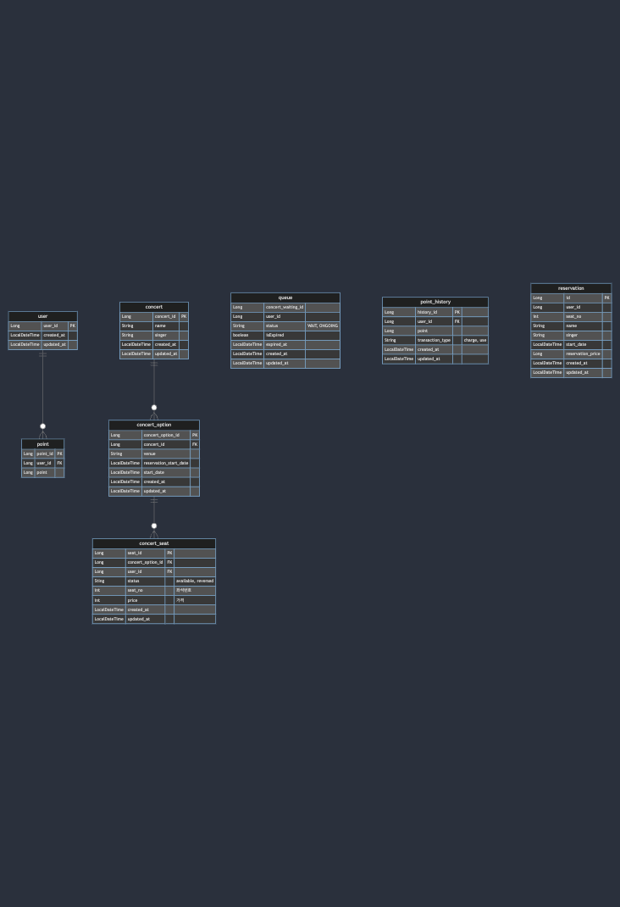

[](https://mermaid.live/edit#pako:eNq1Vc1u00AQfhVrz27kOIlT-4ZUqKpCi5RKSChSNLWHZEWya9br0JBW4sCBAw_AhQs3bqgnnqmUd2C8joXjn1aizUaK1jOzs9_37czumoUyQhYwVAccpgoWY2HRSBNU1uXl3p5cW7HkQluBNWb0--dd5_NsPJdiaowTHlkvj8uOEOYHoPGML9AKFdI0moBui0jjaCviaizySY6huqWx1vcsgXl23LSkkjyUIkSlC76bz4mMNZdii3gRWQVSLKlAGWnFyStggTVjQn-odiBVBX6FVEJ5myjljiqvzNio7_YmjUo3HcFIG-oadJoQBlgCn8P5HG1L4RJVglEBKxvZkRsEQlLw7fcvt5--_b7-_Ofrr2pUrHiIFHPz8-PN9Y-yd0eyru_Vo1WymiSmHJYoUmwDpZC0XIJJTeJRkgxkW_T9EQ-Q4V2KKbaxfw88O2Ci2FwL9SYoKuHVk6Mz2zo9OTw9Ojksn9-5lHMEYfHk6UXMFUZtiDF338HpodfPZMYTLdWq1iUb-39fRCVBtAKRQGhOWq_irKbDGagpdQhl2klhl4qrxuwuRo19-hh3X3P90rJyG5iOf0Q1mM0WqBbAI3oMjQxjpmdI4Fl2W0ag3mbqZ3GQajlaiZAFWqVoszzX5vksjBhxqokX-eNq3libxSBYsGYXLOgPO8N9x3Ucv--5ru_0bLZigT_skKHb3Xedgev2vd6VzT5ISTmdju8Puo7vuF3P63newDfZXhvnG5gnePUXkJtzkw)

<!-- 
erDiagram
user ||--o{ point : ""
user {
Long user_id PK
LocalDateTime created_at
LocalDateTime updated_at
}

    point {
        Long point_id PK
        Long user_id FK
        Long point
    }

    concert ||--o{ concert_option : ""
    concert {
        Long concert_id PK
        String name
        String singer
        LocalDateTime created_at
        LocalDateTime updated_at
    }

    concert_option ||--o{ concert_seat : ""
    concert_seat {
        Long seat_id PK
        Long concert_option_id FK
        Long user_id FK
        Sting status "available, reversed"
        int seat_no "좌석번호"
        int price "가격"
        LocalDateTime created_at
        LocalDateTime updated_at
    }

    concert_option{
        Long concert_option_id PK
        Long concert_id FK
        String venue
        LocalDateTime reservation_start_date
        LocalDateTime start_date
        LocalDateTime created_at
        LocalDateTime updated_at
    }

    queue{
        Long concert_waiting_id
        Long user_id
        String status "WAIT, ONGOING"
        boolean isExpired
        LocalDateTime expired_at
        LocalDateTime created_at
        LocalDateTime updated_at
    }

    point_history {
        Long history_id PK
        Long user_id FK
        Long point
        String transaction_type "charge, use"
        LocalDateTime created_at
        LocalDateTime updated_at
    }

    reservation {
        Long id PK
        Long user_id 
        int seat_no
        String name
        String singer
        LocalDateTime start_date
        Long reservation_price
        LocalDateTime created_at
        LocalDateTime updated_at
    }
-->