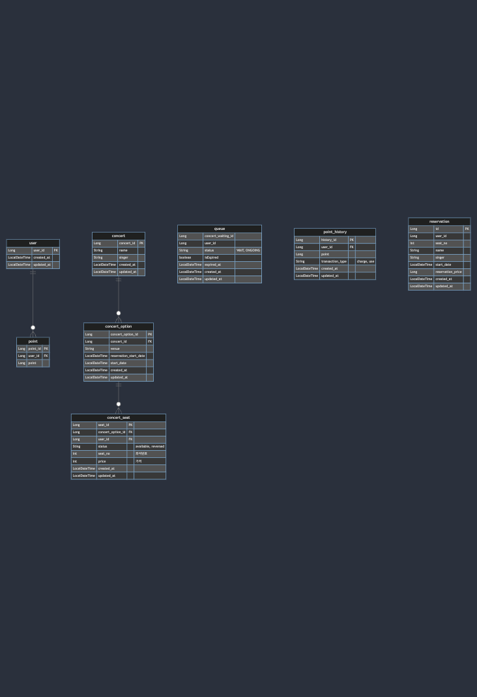

[](https://mermaid.live/edit#pako:eNq1Vc1q20AQfhWxZ8XIsi1HuhXShpA2KThQKAYzkab2UntXXa3cuI6hhx566AP00ktuuZWc-kxp-g4drWwq6yeBJl6DWc3Mzn7ftzO7SxbKCFnAUB1wGCuYDYVFI01QWZeXe3tyacWSC20F1pDR7593mc-z8VKKsTGOeGS9Pi46QpgegMYzPkMrVEjTaAS6KSKNo62I1VDkkxxDeUtjre5ZAPPiuG5JKXkoRYhKb_iuP0cy1lyKLeKbyDKQzZISlIFWnLwCZlgxJvSHagdSleCXSCWUt45S7ijzyoy1-m5vUqt03REMtKGuQacJYYA58CmcT9G2FM5RJRhtYGUjO3KDQEgKvrv6dvflx--br3--_ypHxYqHSDG3Pz_f3lwXvTuSdfmgHo2SVSQx5TBHkWITKIWk5RxMahKPkmQgm6IfjniEDB9STLGJ_Ufg2QETxfpaqDbBphLePDs6s63Tk8PTo5PD4vmdSzlFEBZPnl_EXGHUhBhz9z2cHnv9jCY80VItKl2ytv_3RVQQRCsQCYTmpPUizmo6nIAaU4dQpp0UdqG4KszuY1Tbp09x99XXLy0rtoHp-CdUg9lshmoGPKLH0MgwZHqCBJ5lt2UE6n2mfhYHqZaDhQhZoFWKNstzrZ9PFryDaUJWjDgVxav8dTWPrM1iECxYsgsWdPut_r7jOo7f9VzXdzo2W7DA77fI0G7vu07PdbteZ2WzT1JSUqfl-7224ztu2_M6ntfzTba3xml2XP0FBzFz3g)

<!-- 
erDiagram
user ||--o{ point : ""
user {
Long user_id PK
LocalDateTime created_at
LocalDateTime updated_at
}

    point {
        Long point_id PK
        Long user_id FK
        Long point
    }

    concert ||--o{ concert_option : ""
    concert {
        Long concert_id PK
        String name
        String singer
        LocalDateTime created_at
        LocalDateTime updated_at
    }

    concert_option ||--o{ concert_seat : ""
    concert_seat {
        Long seat_id PK
        Long concert_option_id FK
        Long user_id FK
        Sting status "available, reversed"
        int seat_no "좌석번호"
        int price "가격"
        LocalDateTime created_at
        LocalDateTime updated_at
    }

    concert_option{
        Long concert_option_id PK
        Long concert_id FK
        String venue
        LocalDateTime reservation_start_date
        LocalDateTime start_date
        LocalDateTime created_at
        LocalDateTime updated_at
    }

    queue{
        Long concert_waiting_id
        Long user_id
        String status "WAIT, ONGOING"
        boolean isExpired
        LocalDateTime expired_at
        LocalDateTime created_at
        LocalDateTime updated_at
    }

    point_history {
        Long history_id PK
        Long user_id FK
        Long point
        String transaction_type "charge, use"
        LocalDateTime created_at
        LocalDateTime updated_at
    }

    reservation {
        Long id PK
        Long user_id 
        int seat_no
        String name
        String singer
        LocalDateTime start_date
        Long reservation_price
        LocalDateTime created_at
        LocalDateTime updated_at
    }
-->